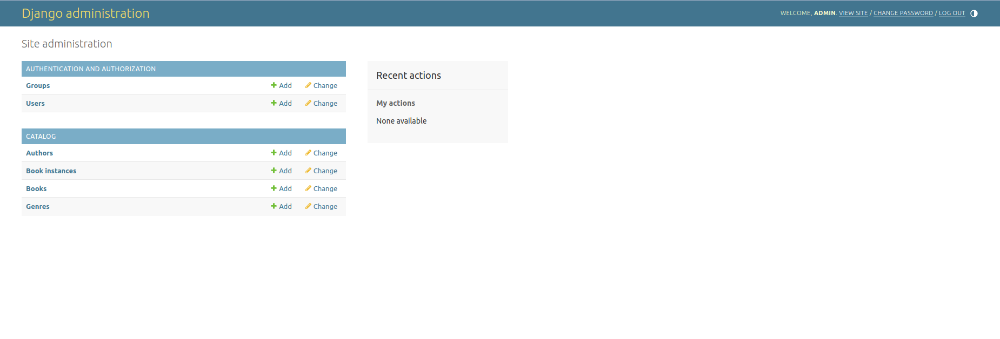

# Django tutorial 
Following a Django MDN tutorial to learn more about DJango.


## Description

The purpose of this project is for learning:
* Learning Django in general
* python
* Using virtual environments
* Creating a web application with Django


### Dependencies

* python3
* pip3
* virtualenvwrapper

### Executing program

* Enter virtual evironment:
```
workon <virtual_environment_name>
```
* Start the server: 
```
python3 manage.py runserver
```

## Adding data to db

Use script add_data.py and run it as follows:
```
python add_data.py
```

And to add book instances:
```
python add_book_instances.py
```

## Acknowledgments

The tutorial
* [MDN Django tutorial](https://developer.mozilla.org/en-US/docs/Learn/Server-side/Django/development_environment)
* [Source code for the tutorial](https://github.com/mdn/django-locallibrary-tutorial)
* [Django Documentantion](https://docs.djangoproject.com/en/4.2/intro/overview/)

